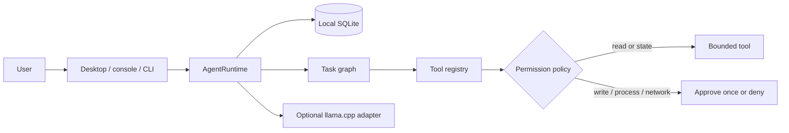

# NIRA Local Assistant

> A local-first Python desktop assistant that plans and remembers useful work while keeping filesystem, process, and network side effects under explicit user control.

**Status:** v0.4.0 release candidate on `product-completion-2026`. Deterministic offline mode, persistent sessions, bounded tools, desktop permissions, 48 tests, and wheel installation are verified. A real local model is configurable but has not been verified on this machine.

[Architecture](docs/ARCHITECTURE.md) · [Security review](docs/SECURITY_REVIEW.md) · [Test report](docs/TEST_REPORT.md) · [Case study](docs/CASE_STUDY.md) · [Interview guide](docs/INTERVIEW_GUIDE.md)

## Demo


The current desktop flow has five inspected screenshots in [the UI/UX audit](docs/design/UI_UX_AUDIT.md). The final v0.4 walkthrough is being re-recorded from the current build and will run for at least three minutes; the target is approximately four minutes with captions.

## Problem and users

Assistant runtimes often mix intent, model output, and privileged actions. NIRA separates those boundaries and fails closed when approval or a safe path is missing. It is for developers reviewing local-assistant architecture, privacy-conscious technical users, and engineers evaluating explicit tool authorization.

## Key features

- Fast, honest deterministic-offline mode.
- Searchable, pinnable, exportable, deletable local SQLite conversations.
- Bounded project inspection and workspace file reading.
- Coding, research, document, and workflow task plans.
- Explicit approval for workspace writes, processes, and network tools.
- Visible desktop/console progress and safe failures.
- Optional llama.cpp-compatible local endpoint routing.

## Safety model

| Access class | Default | Examples |
| --- | --- | --- |
| Read | Allowed | project inspection, contained file read |
| NIRA state | Allowed | conversations, generated proposal artifact |
| Workspace write | Denied | edit file, dependency/config change |
| Process | Denied | compile, test, build command |
| Network | Denied | URL research, download |

Permission is enforced in the tool registry before tool code runs. A denial is treated as a user decision and is not automatically repaired or retried.

## Architecture



See [the architecture guide](docs/ARCHITECTURE.md) for canonical and legacy boundaries.

## Stack and structure

Python 3.11+, Tk, SQLite, requests, psutil, NumPy, pytest, setuptools, and an optional llama.cpp-compatible HTTP endpoint.

```text
nira/core/          canonical runtime and path controls
nira/intelligence/ intent, planning, confidence, reflection
nira/task_graph/    dependency graph and executor
nira/tools/         canonical tool implementations
nira/security/      permission policy and optional legacy security
nira/memory/        conversations and retrieval stores
nira/interface/     Tk desktop, console, progress, notifications
nira/models/        model registry, routing, llama.cpp adapter
local_llm/          optional managed llama.cpp integration
tests/              48 automated tests
docs/               product, security, test, design, and demo evidence
```

## Setup

```powershell
python -m venv .venv
.\.venv\Scripts\python -m pip install --upgrade pip
.\.venv\Scripts\python -m pip install -e .
```

For development and release checks:

```powershell
.\.venv\Scripts\python -m pip install -e ".[dev]"
```

## Configuration and modes

No credentials are required for offline mode. [.env.example](.env.example) documents `NIRA_*` variables. Never commit model binaries, tokens, databases, or state directories.

```powershell
# Desktop or console
.\.venv\Scripts\python -m nira
.\.venv\Scripts\python -m nira --console

# Health and two bounded tools
.\.venv\Scripts\python -m nira --health --state-dir .\.local-state
.\.venv\Scripts\python -m nira --inspect . --workspace .
.\.venv\Scripts\python -m nira --read-file README.md --workspace .

# Only when a configured endpoint is actually running
.\.venv\Scripts\python -m nira --enable-local-model
```

See [the API/CLI reference](docs/API.md) and [development guide](docs/DEVELOPMENT.md).

## Testing and packaging

```powershell
.\.venv\Scripts\python -m pytest -q
.\.venv\Scripts\python -m compileall -q nira nira_agent local_llm main.py
.\.venv\Scripts\pip-audit --skip-editable
.\.venv\Scripts\python -m build
```

Current evidence: **48 tests passed**, dependencies are consistent, no known dependency vulnerabilities were found in the audited environment, and the v0.4 wheel returned healthy JSON from a clean virtual environment outside the repository.

## Privacy and security

- Conversation data is local SQLite and not cloud-synced.
- Interaction-training logs are disabled by default.
- File paths are resolved inside a selected root.
- Public URL validation rejects credentials and direct private/local hosts.
- Permission history is bounded in memory and excludes tool arguments.
- The canonical database is not encrypted; protect the state directory with OS access controls.

Read [SECURITY.md](SECURITY.md) and [the security review](docs/SECURITY_REVIEW.md) before enabling side effects.

## Limitations

- No real local model/hardware profile has been verified for v0.4.
- Transcript rendering is plain text; attachments and rich Markdown are incomplete.
- Voice, OCR, PyQt overlay, and older encrypted-memory modules are outside the core test contract.
- Accessibility has screenshot/source evidence but no Narrator/NVDA or full scaling matrix.
- Windows is the only visually audited desktop platform.
- This is a local prototype, not a hosted service or unrestricted autonomous agent.

## Roadmap and contribution

Next: model status and one verified model profile, permission timeline, memory lifecycle controls, retrieval evaluation/citations, rich messages, recovery tests, and manual accessibility evidence. See [VERSION_ROADMAP.md](docs/VERSION_ROADMAP.md) and [CONTRIBUTING.md](CONTRIBUTING.md).

`nira_agent` is a compatibility namespace for historical imports. Optional legacy modules are not evidence for v0.4 completion.

## License status

No license file is present. All rights remain with the copyright holder unless the owner makes an explicit licensing decision.
