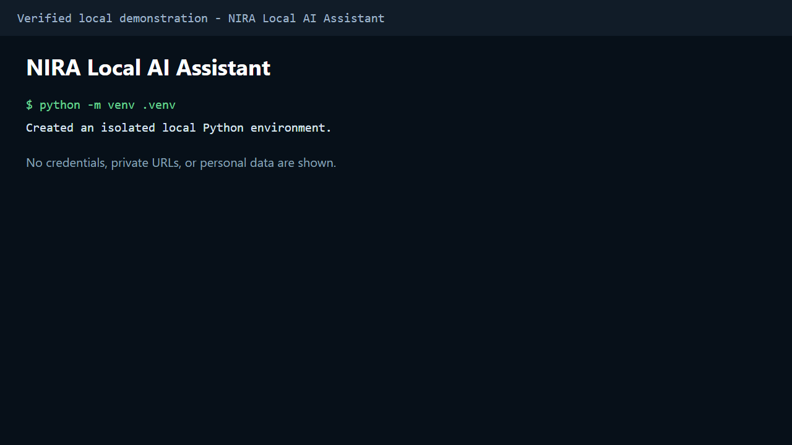
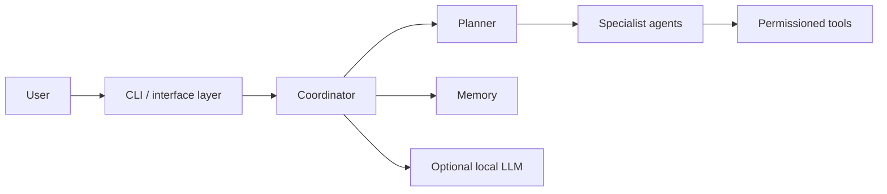

# NIRA Local AI Assistant

> **Status: Active Development** — The core Python runtime installs reproducibly and 32 automated tests pass.

[](docs/demo/demo.webm)

> Watch the verified terminal walkthrough of setup, tests, architecture, and optional integration boundaries.

NIRA is a modular, local-first assistant runtime for planning tasks, coordinating specialist agents, and running permissioned automation. It is intended for developers exploring auditable desktop assistance without making cloud services or unrestricted autonomy mandatory.

## Why it exists

General-purpose assistants often hide planning and tool boundaries. NIRA separates coordination, reasoning, permissions, memory, interfaces, and optional local-model access so each stage can be tested and replaced independently.

## Highlights

- Coordinator and specialist-agent architecture
- Task graph, planning, confidence, and goal-execution modules
- Permission-aware automation registry with undo support
- Memory, monitoring, research, workflow DSL, and plugin interfaces
- Optional llama.cpp runtime for local inference
- Core behavior covered by pytest

## Architecture



See [docs/ARCHITECTURE.md](docs/ARCHITECTURE.md) for component and trust boundaries.

## Quick start

```powershell
python -m venv .venv
.\.venv\Scripts\python -m pip install -e .
.\.venv\Scripts\python -m nira
```

Run the verified core suite:

```powershell
.\.venv\Scripts\python -m pytest -q
```

The voice, OCR, browser, Windows automation, and local-model paths may require optional system packages beyond the core install. See [nira/README.md](nira/README.md) and [local_llm/README.md](local_llm/README.md).

## Demo package

The recording script, storyboard, captions, and manual guide are in [docs/demo](docs/demo).

## Security and limitations

NIRA is a research-oriented local runtime, not an unrestricted autonomous agent. Review every tool permission, keep credentials outside the repository, and test automation in disposable directories. Optional integrations were not treated as verified merely because the core suite passes.

## Project documentation

- [Development guide](docs/DEVELOPMENT.md)
- [Test report](docs/TEST_REPORT.md)
- [Troubleshooting](docs/TROUBLESHOOTING.md)
- [Security policy](SECURITY.md)

## License

No license file is currently present. All rights remain with the copyright holder unless a license is added manually.
