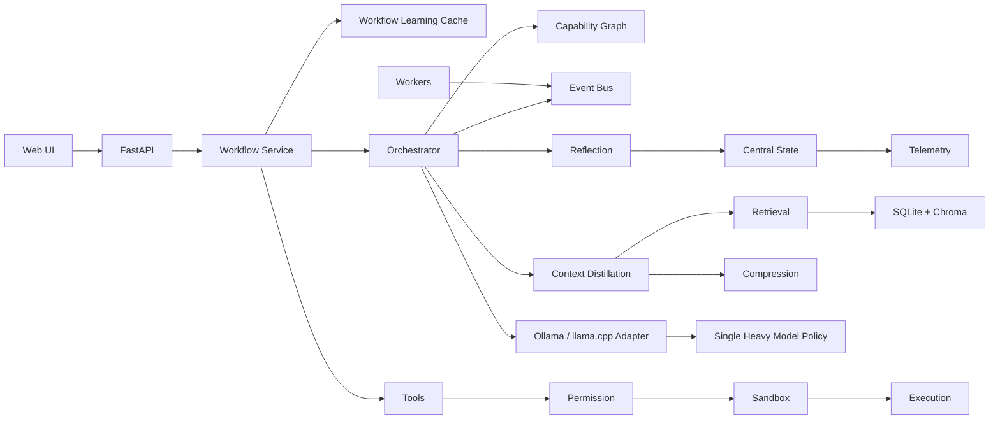

# NIRA Mini

NIRA Mini is a local-first adaptive cognitive runtime for CPU-only laptops. It is designed around orchestration, memory, context economics, safe tools, event traces, reflection, and usage learning rather than oversized models or large prompts.

## Daily Start

```bash
python main.py start
```

Startup validates dependencies, initializes memory and telemetry storage, starts worker pools, checks Ollama and Redis when available, prints a health summary, and exposes:

- UI: `http://127.0.0.1:8787/ui`
- API: `http://127.0.0.1:8787`
- Prometheus metrics: `http://127.0.0.1:8787/metrics`

Run a deterministic showcase without Ollama:

```bash
python main.py demo
```

## Project Layout

```text
NIRAMini/
|-- nira_core/
|   |-- agents/
|   |-- api/
|   |-- capabilities/
|   |-- compression/
|   |-- config/
|   |-- events/
|   |-- inference/
|   |-- memory/
|   |-- orchestration/
|   |-- reflection/
|   |-- retrieval/
|   |-- routing/
|   |-- runtime/
|   |-- sandbox/
|   |-- state/
|   |-- telemetry/
|   |-- tools/
|   |-- voice/
|   |-- workers/
|   `-- __init__.py
|-- tests/
|-- scripts/
|-- docker/
|-- requirements.txt
|-- README.md
|-- .env
`-- main.py
```

## Setup

```bash
bash scripts/setup_linux.sh
bash scripts/pull_models.sh
python main.py start
```

Required local models:

- `phi:3`
- `qwen2.5-coder:7b-gguf-q4_k_m`

Optional future route:

- `qwen2.5:14b-gguf-q4_k_m`

If Ollama is offline, NIRA keeps the runtime alive and returns a degraded inference response instead of crashing.

## Usable Workflows

Coding assistant:

```bash
curl -X POST http://127.0.0.1:8787/workflows/coding \
  -H "Content-Type: application/json" \
  -d '{"goal":"Explain this Python error and suggest a fix"}'
```

Browser research:

```bash
curl -X POST http://127.0.0.1:8787/workflows/research \
  -H "Content-Type: application/json" \
  -d '{"goal":"Research local-first AI orchestration patterns"}'
```

Multi-step planner:

```bash
curl -X POST http://127.0.0.1:8787/workflows/planner \
  -H "Content-Type: application/json" \
  -d '{"goal":"Plan a safe research workflow, summarize findings, and save memory"}'
```

Repeated successful workflows are cached locally for a short TTL and surfaced through workflow analytics. Cache entries require a high success score, so failed or degraded answers are not reused.

## UI

The lightweight FastAPI UI includes:

- Chat with model/task routing
- Voice capture and local transcription when faster-whisper is installed
- Workflow progress display
- Memory timeline and search
- Pin, archive, and delete memory controls
- Live RAM, CPU, compression, retrieval, model, queues, tasks, and event panels
- Route confidence, workflow success, cache hits, and useful recall metrics

Static assets live under `nira_core/api/static/`.

## Memory

Memory persists in `.nira_data/`:

- Working memory: in-RAM current session
- Episodic memory: SQLite task timeline
- Semantic memory: ChromaDB when available, deterministic fallback otherwise

Memory endpoints:

- `GET /memory/timeline`
- `GET /memory/recent`
- `GET /memory/summaries`
- `POST /memory/search`
- `POST /memory/{id}/pin`
- `POST /memory/{id}/archive`
- `DELETE /memory/{id}`

Pinned memories are protected from decay cleanup. Recall quality is tracked as useful recall percentage and irrelevant recall count.

## Observability

Runtime endpoints:

- `GET /health`
- `GET /state`
- `WS /state/ws`
- `GET /events/replay`
- `GET /telemetry`
- `GET /analytics/summary`
- `GET /workflows/templates`
- `GET /reflection`
- `GET /models`
- `GET /metrics`
- `POST /voice/transcribe`

Grafana and Prometheus:

```bash
docker compose -f docker/docker-compose.yml up --build
```

Grafana opens on `http://127.0.0.1:3000`.

## Architecture



## Runtime Behavior

NIRA adapts visibly:

- Simple low-complexity classification requests use a fast path without retrieval or compression.
- Inference queue pressure can downgrade expensive routes to `phi:3`.
- RAM pressure shrinks context and avoids large reasoning models.
- Local inference failure falls back to the fast route, then to a degraded but stable response.
- Worker failures are recorded and retryable task envelopes are paced before requeue.
- Event replay, telemetry, and analytics explain why decisions were made.

## Troubleshooting

Ollama unavailable:

```bash
ollama serve
ollama pull phi:3
ollama pull qwen2.5-coder:7b-gguf-q4_k_m
```

Playwright browser errors:

```bash
python -m playwright install chromium
```

Redis unavailable:

NIRA uses in-memory queues automatically. Redis is optional for local single-process use.

Chroma warnings:

ChromaDB may emit Pydantic deprecation warnings from dependencies. Set `NIRA_DISABLE_CHROMA=1` to force the deterministic local semantic-memory fallback during validation or constrained runs.

## Verification

```bash
pytest
python -m compileall -q nira_core main.py system_validation.py
python main.py models
python main.py demo
python system_validation.py --full
```

`system_validation.py --full` runs simulated daily workflows, workflow-cache checks, analytics checks, queue backpressure checks, worker retry checks, memory deduplication checks, degraded-inference checks, and long-session stability checks without requiring live Ollama models.
