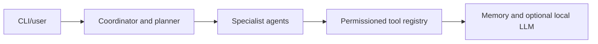

# NIRA Local AI Assistant architecture

Modular local-first assistant runtime with planning, automation permissions, specialist agents, memory, and optional local LLM support.

## System view

## Component boundaries

- **CLI/user:** initiates the primary workflow.
- **Coordinator and planner:** owns one stage of the request or interaction flow.
- **Specialist agents:** owns one stage of the request or interaction flow.
- **Permissioned tool registry:** owns one stage of the request or interaction flow.
- **Memory and optional local LLM:** provides the terminal integration or persistence boundary.

## Runtime and trust boundaries

Voice, OCR, browser, and local-model features require optional system dependencies and are not validated by the core test suite. Inputs crossing a network, filesystem, provider, or database boundary should be validated and logged without sensitive values. Optional integrations must fail clearly rather than being presented as successful.

## Technology

Python 3.11+, pytest, requests, psutil, optional llama.cpp and desktop integrations.

