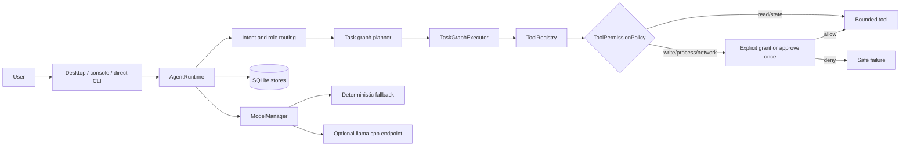

# Architecture

NIRA v0.4 uses `nira.core.AgentRuntime` as the canonical lifecycle for desktop, console, CLI, and Python callers.

## Responsibilities

- `AgentRuntime`: intent, context, memory retrieval, plan, execution, reflection, persistence, metrics.
- `TaskGraphExecutor`: dependency order, progress, one narrow repair, stop/block behavior.
- `ToolRegistry`: canonical authorization point before `Tool.run`.
- `ToolPermissionPolicy`: access grants, approve-once callback, bounded argument-free decision history.
- `resolve_within_root`: path containment for workspace and state boundaries.
- `ConversationStore`: named local sessions and export/delete lifecycle.
- `ModelManager`: optional model routing, cache limits, and latency evidence.

## Trust boundaries

Workspace paths, commands, URLs, model endpoints, exported files, and optional OS features are untrusted. Capability selection never grants authority. Interaction logs and network/model access are opt-in.

## Canonical versus legacy

Historical automation, encrypted memory, PyQt overlay, and routing modules remain available through the `nira_agent` compatibility namespace. They are not on the v0.4 canonical request path. Some require `legacy-security` or `legacy-qt` extras and are not covered by the 48-test core contract.
