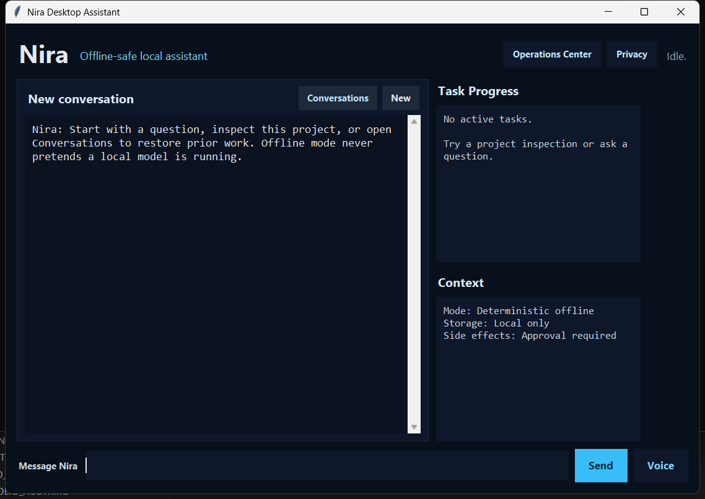
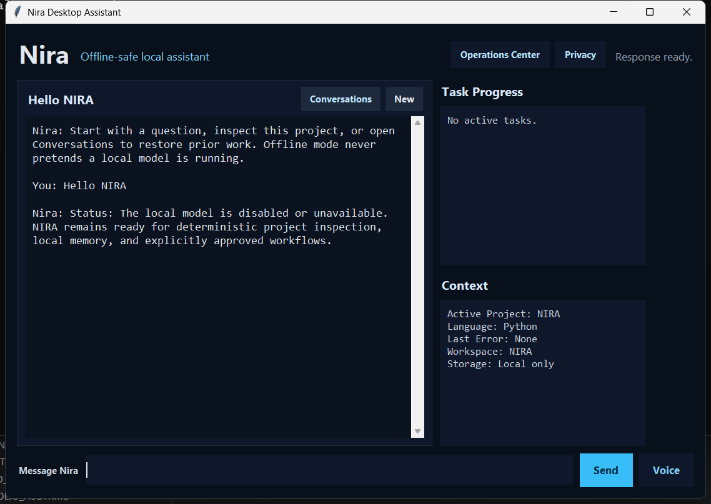
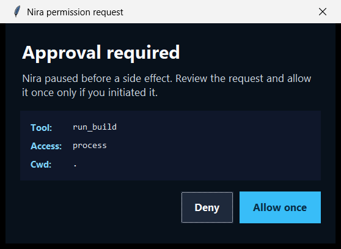
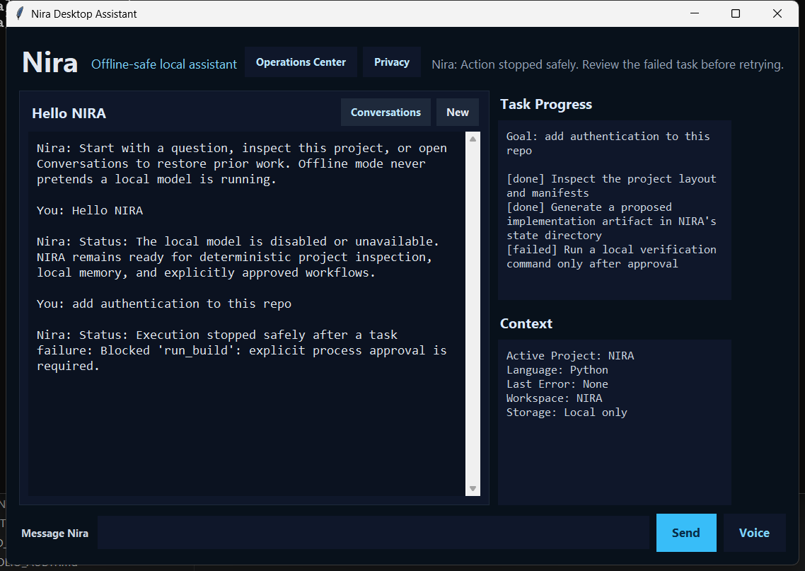
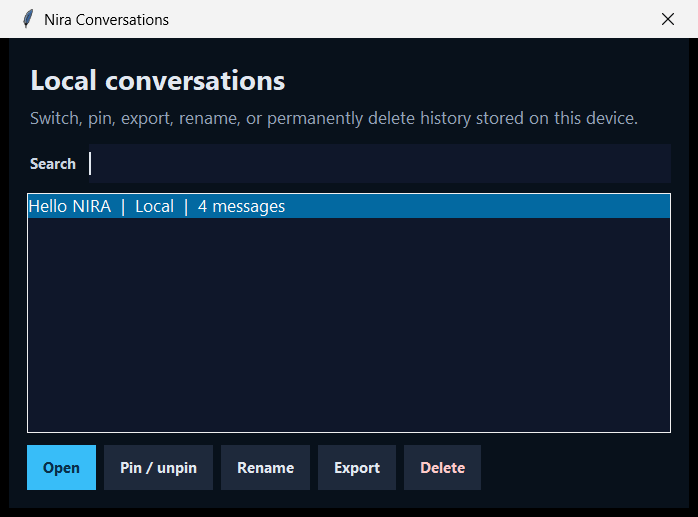
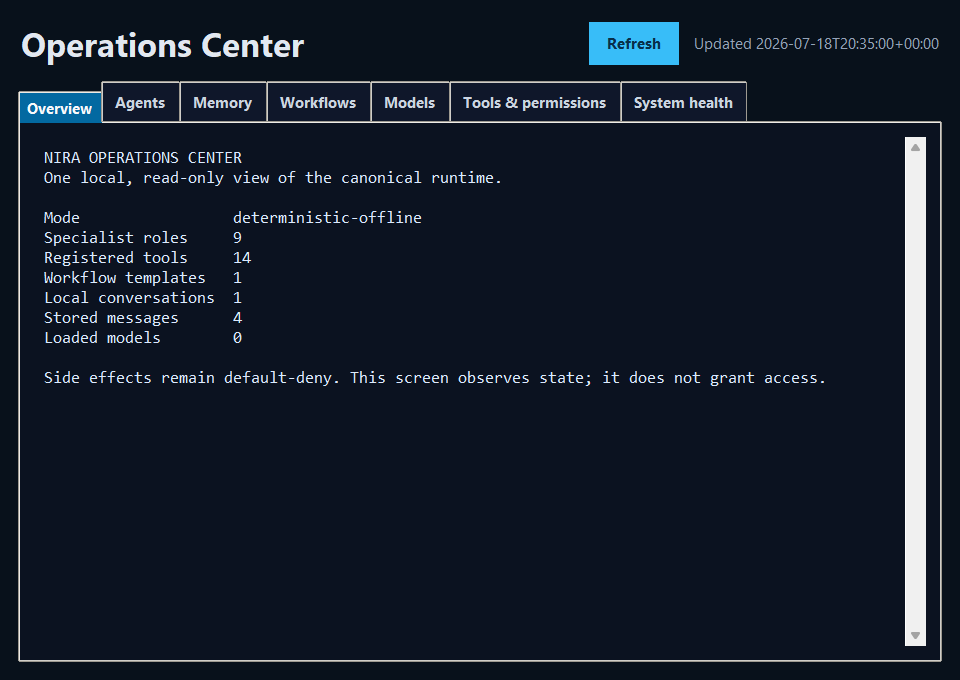
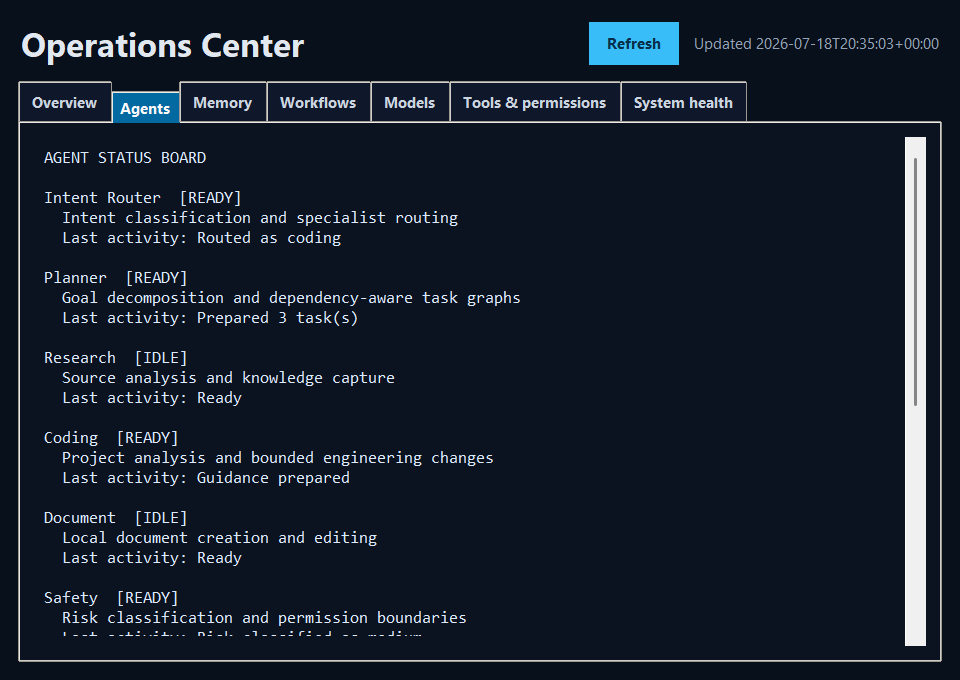
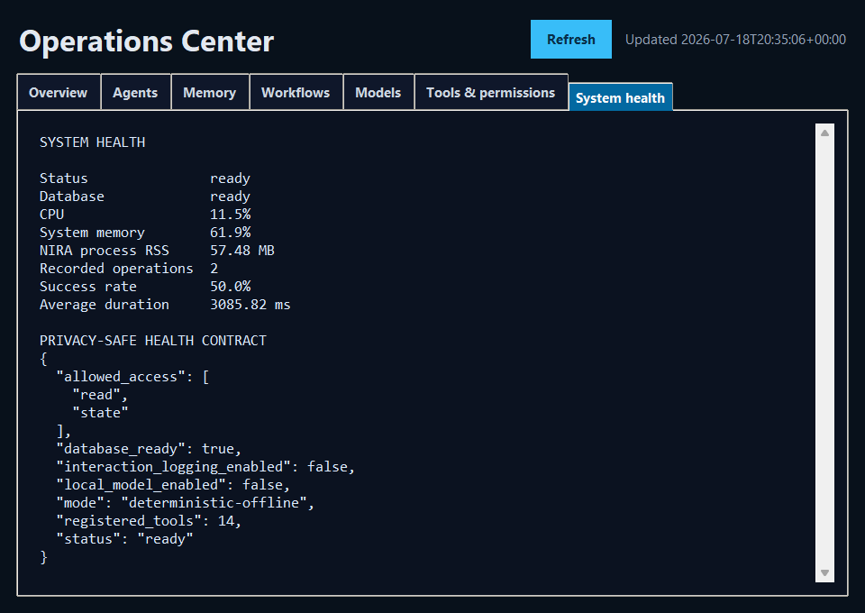

# NIRA desktop product-flow audit

Audit date: 19 July 2026

Build audited: `product-integration-v0.5` working tree after the Operations Center pass
Mode: combined UX and screenshot-based accessibility audit  
User goal: start a conversation, understand offline behavior, and safely attempt a coding workflow.

## Overall verdict

The corrected desktop flow is coherent and usable at its 1120 x 760 default: the composer stays visible, offline status is honest, task progress is readable, permissions are explicit, local conversations are manageable, and the canonical runtime has a privacy-safe Operations Center. It is credible as a technical desktop prototype. It is not yet a finished general-purpose assistant UI because rich message rendering, attachments, responsive reflow below the declared minimum, and assistive-technology verification remain open.

## Flow evidence

### Step 1 - Open the empty assistant

Health: **Healthy**

Strengths:

- Product name, offline-safe positioning, conversation, progress, context, privacy, and message controls are immediately visible.
- The dark palette and restrained cyan accent are consistent.
- The empty state suggests useful first actions and does not imply that a local model is bundled.

Findings:

- Keyboard shortcuts exist for new conversation, history, and composer focus but are not yet surfaced inside the interface.
- The fixed two-column layout is intentionally desktop-first and has not been verified below 960 x 640.

### Step 2 - Receive an offline response

Health: **Healthy with presentation limits**

Strengths:

- The response honestly distinguishes deterministic offline behavior from a configured local model.
- Project, language, error, and working-directory context are visible alongside the response.

Findings:

- The response transcript no longer includes duplicate success notifications or an absolute local path.
- The fixed-width transcript is readable for technical content but still lacks markdown rendering, code highlighting, timestamps, and copy affordances.

### Step 3 - Review a process permission request

Health: **Healthy**

Strengths:

- The dialog names the tool, access class, and working directory before any process is started.
- `Deny` receives initial focus and `Allow once` is explicitly scoped to one request.

Findings:

- The dialog does not yet show a plain-language explanation of the exact command's expected output or duration.
- Approval history is available through the console but is not yet visible in the desktop sidebar.

### Step 4 - Deny the process and recover safely

Health: **Healthy**

- The attempted workflow stops, the failed task remains visible, and the transcript states that `run_build` was blocked.
- A denied permission is no longer sent through the automated repair loop, so one denial cannot trigger a second prompt.
- The raw header warning captured in this frame led to a follow-up copy fix: the current code now says that the action stopped safely and recommends reviewing the failed task.

### Step 5 - Manage local conversation history

Health: **Healthy**

- Users can search, open, pin, rename, export, and confirmation-delete locally stored sessions.
- The dialog explains storage scope and uses text labels for every destructive or persistent action.
- Search and all Open/Pin/Rename/Export/Delete actions are visible in the accepted recapture.

### Step 6 - Inspect integrated runtime state

Health: **Healthy with explicit evidence limits**

- All seven tabs fit at the audited 960 x 680 Operations Center size.
- Long agent, workflow, tool, and health content is scrollable rather than clipped.
- Agent activity reflects the real sequential runtime and does not claim parallel execution.
- System Health deliberately omits workspace paths, state directories, and conversation identifiers.
- The window is read-only; Refresh observes the runtime and cannot grant a permission.

## Changes completed from the audit

1. Made the process DPI-aware and kept the composer visible at the default window size.
2. Added restored history, search, new/open/pin/rename/export/delete controls, and local-only explanations.
3. Added a default-deny approve-once desktop dialog and prevented permission denials from auto-retrying.
4. Removed duplicate transcript notifications and replaced raw failure copy with recovery guidance.
5. Added an actionable empty state plus visible offline, privacy, storage, and side-effect status.
6. Added a scrollable Operations Center grounded in the canonical product snapshot and filtered its visible health contract for screenshot privacy.

## Remaining opportunities

1. Add markdown, code highlighting, copy actions, and attachment handling.
2. Add filtering and export for permission evidence and deeper measured local-model diagnostics.
3. Verify the full keyboard path and Windows accessibility tree with Narrator or NVDA.
4. Measure contrast and test Windows scaling, high-contrast mode, and the declared minimum window size.

## Accessibility risks

- Focus uses platform/Tk treatment; a deliberate high-visibility focus system has not been verified.
- Status and task changes are visual only; assistive-technology announcement behavior is unverified.
- Text scaling, 200% zoom/reflow, Windows high-contrast mode, and screen-reader names were not tested.
- The screenshot suggests acceptable foreground/background separation, but contrast ratios were not measured.

## Evidence limits

These findings use eight current-build screenshots, an app-written transcript check, persisted SQLite evidence, and source inspection. The earlier DPI-mismatched captures are retained under `audit/` with a rejection notice and are not evidence. Screenshots cannot establish keyboard completeness, screen-reader output, contrast ratios, target sizes, reduced-motion behavior, or WCAG conformance. The audit therefore does not claim accessibility compliance.
